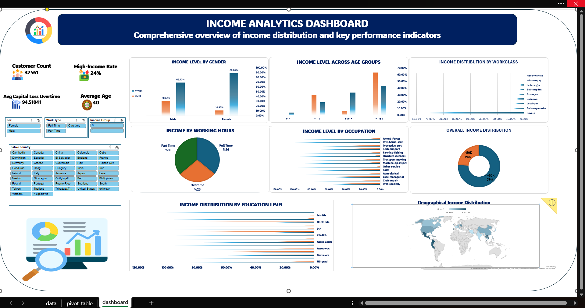

# 📊 Income & Demographic Analytics Dashboard

## 📌 Project Overview

An interactive **Income & Demographic Analytics Dashboard built entirely in Microsoft Excel**, designed to analyze income patterns across demographic, educational, occupational, and employment-related dimensions.

The project transforms **32,561 records** into an interactive analytical dashboard using Excel data preparation, PivotTables, PivotCharts, calculated fields, and Slicers.

The dashboard provides a structured view of income distribution and helps identify the demographic and professional characteristics associated with higher income levels.

---

## 🎯 Business Objective

The main objective of this project is to understand the relationship between income and different demographic and employment factors.

The dashboard answers questions such as:

* What percentage of individuals earn above $50K?
* How does income differ by gender?
* Which age groups have the highest income levels?
* How does education affect income?
* Which occupations have the highest proportion of higher-income individuals?
* How does working type relate to income?
* How does income vary across workclass categories?
* What is the geographical distribution of income?

---

## 📂 Dataset

The dataset contains **32,561 records** with demographic, educational, employment, and income-related information.

### Main Variables

* Age
* Age Group
* Workclass
* Education
* Education Number
* Marital Status
* Occupation
* Relationship
* Race
* Sex
* Capital Gain
* Capital Loss
* Hours per Week
* Work Type
* Native Country
* Income Group
* Income

---

## 🧹 Data Preparation & Transformation

The dataset was prepared and transformed in Excel to make it suitable for analysis and dashboard development.

Key preparation steps included:

* Data inspection and cleaning
* Handling categorical values
* Creating age-group classifications
* Creating work-type categories
* Creating income-group classifications
* Preparing analytical fields
* Organizing data for PivotTable analysis
* Building calculated analytical metrics

---

## 📊 Key Performance Indicators

The dashboard includes the following KPIs:

| KPI                             |  Value |
| ------------------------------- | -----: |
| Total Records                   | 32,561 |
| High-Income Rate                | 24.08% |
| Average Age                     |  38.58 |
| Average Capital Loss – Overtime |  94.51 |

---

## 📈 Dashboard Analysis

### 👥 Income Level by Gender

Compares income distribution between male and female groups and highlights differences in representation across the two income categories.

---

### 🎂 Income Level Across Age Groups

Analyzes income distribution across different age segments to identify which groups have a stronger representation of higher-income individuals.

---

### 💼 Income Distribution by Workclass

Examines income levels across different employment classifications, including private-sector and government-related workclasses.

---

### ⏱️ Income by Working Hours

Analyzes the relationship between working patterns and income using categories such as:

* Full Time
* Part Time
* Overtime

---

### 🧑‍💼 Income Level by Occupation

Compares income distribution across different occupations to identify professional categories with stronger higher-income representation.

---

### 🎓 Income Distribution by Education

Analyzes income levels across education groups and demonstrates how educational attainment relates to income distribution.

---

### 🌍 Geographical Income Distribution

Provides a geographical perspective by analyzing income distribution across individuals' native countries.

---

## 🔍 Key Insights

* **24.08%** of the analyzed records belong to the higher-income group.
* The average age across the dataset is approximately **38.58 years**.
* Higher-income representation varies significantly across gender groups.
* Age is an important factor in income distribution, with differences visible across age segments.
* Individuals working overtime show a stronger presence in the higher-income category.
* Higher educational attainment is associated with stronger representation in the higher-income group.
* Professional and managerial occupations show stronger higher-income representation than several other occupational categories.
* Income patterns vary considerably across different workclasses and employment types.

---

## 🎛️ Interactive Dashboard

The dashboard includes interactive Excel **Slicers/Filters** that allow users to dynamically explore the dataset.

Users can segment the analysis based on dimensions such as:

* Gender
* Work Type
* Income Group
* Native Country

This enables users to move from an overall income overview to specific demographic segments.

---

## 📊 Analytical Components

The workbook includes:

* Raw Data
* PivotTables
* PivotCharts
* KPI Cards
* Interactive Slicers
* Demographic Analysis
* Education Analysis
* Occupation Analysis
* Workclass Analysis
* Working Hours Analysis
* Geographical Analysis

---

## 🛠️ Tools & Technologies

* **Microsoft Excel**
* PivotTables
* PivotCharts
* Excel Slicers
* Excel Formulas
* Data Cleaning
* Data Transformation
* Exploratory Data Analysis
* KPI Development
* Dashboard Design
* Business Analytics

---

## 📁 Project Structure

```text
income-demographic-excel-dashboard/
│
├── income-analytics-data.xlsx
├── dashboard-preview.png
└── README.md
```

---

## 🖼️ Dashboard Preview



---

## 💡 Skills Demonstrated

* Data Cleaning & Preparation
* Exploratory Data Analysis
* Demographic Analysis
* Income Analysis
* Data Segmentation
* KPI Development
* PivotTable Analysis
* PivotChart Development
* Interactive Dashboard Development
* Data Visualization
* Business Insight Generation
* Microsoft Excel Analytics

---

## 📌 Conclusion

This project demonstrates how **Microsoft Excel can be used to transform a large demographic dataset into an interactive business analytics solution**.

By combining data preparation, calculated fields, PivotTables, PivotCharts, KPIs, and interactive Slicers, the project provides a comprehensive view of the factors associated with income levels.

The dashboard makes it easier to identify patterns across **age, gender, education, occupation, work type, working hours, and geography**, supporting data-driven analysis and decision-making.

---

### 🚀 Project Type

**Advanced Excel Data Analytics | Income & Demographic Analysis**
